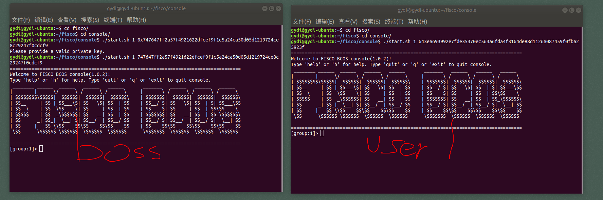
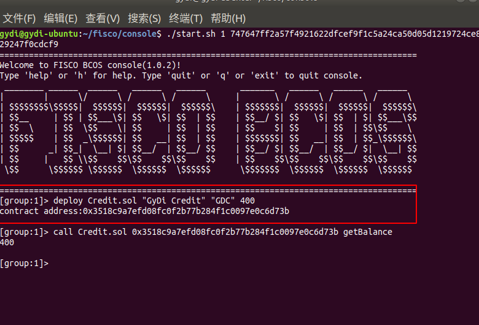
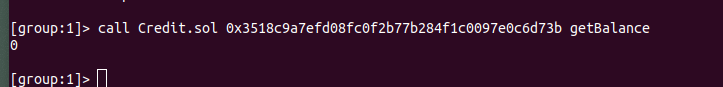
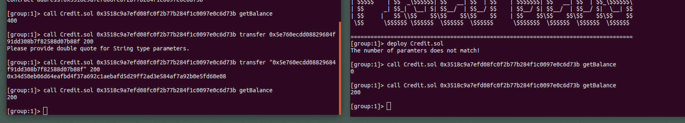
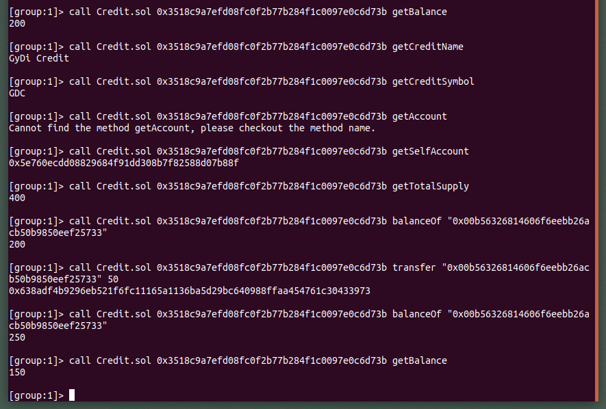
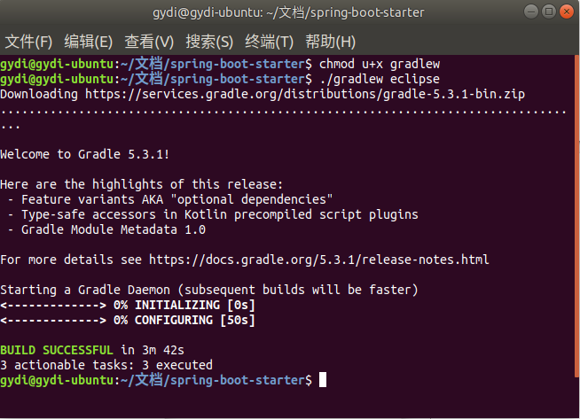
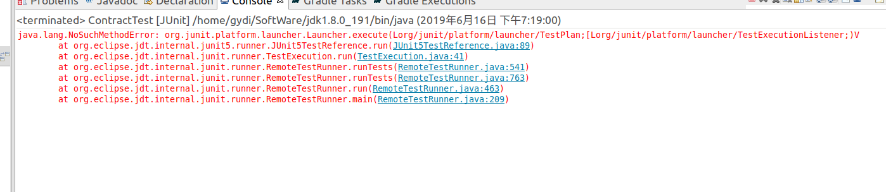
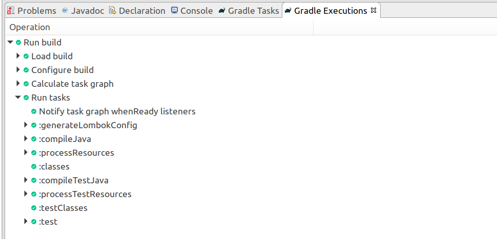
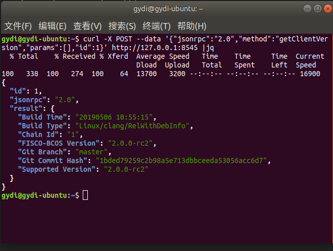
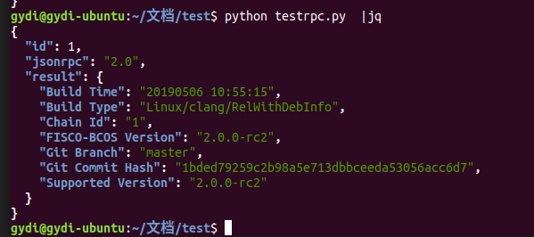

# Day2 笔记

Author: GyDi

## 实验：基于区块链的积分系统

### 实验介绍
本次实验我们实现一个积分系统，由商家进行积分发放，用户进行积分消费。

功能介绍：
1. 总积分初始化
2. 总积分查询
3. 积分转账
4. 积分查询
5. 积分转账明细记录

### 实验步骤

#### 1. 编写智能合约
```solidity
pragma solidity ^0.4.25;

contract Credit{
    string name = "GyDi Credit";
    string symbol = "GDC";
    uint totalSupply;

    mapping(address => uint) public balances;

    event transferEvent(address _from, address _to, uint value);

    constructor (string _name, string _symbol, uint _initSupply) public {
        name = _name;
        symbol = _symbol;
        totalSupply = _initSupply;
        balances[msg.sender] = totalSupply;
    }

    function getTotalSupply() public view returns (uint) {
        return totalSupply;
    }

    function _transfer(address _from, address _to, uint _value) internal {
        require(_to != 0x0, "Could not send to null address.");
        require(balances[_from] >= _value, "The balance is not enough.");
        require(balances[_to] + _value > balances[_to], "Uint overflow.");

        uint prevBalances = balances[_from] + balances[_to];

        balances[_from] -= _value;
        balances[_to] += _value;
        emit transferEvent(_from, _to, _value);
        assert(balances[_from] + balances[_to] == prevBalances);
    }

    function transfer(address _to, uint _value) public {
        _transfer(msg.sender, _to, _value);
    }

    function balanceOf(address _owner) public view returns (uint) {
        return balances[_owner];
    }

    function getBalance() public view returns (uint) {
        return balances[msg.sender];
    }

    function getCreditName() public view returns (string) {
        return name;
    }

    function getCreditSymbol() public view returns (string) {
        return symbol;
    }

    function getSelfAccount() public view returns (address) {
        return msg.sender;
    }
}
```

这里我添了一些功能：
1. `getBalance()`函数用于获取本人的余额。
2. `getSelfAccount()` 用于获取当前用户的地址。
3. `getCreditName()` 用于获取积分的名称。
4. `getCreditSymbol()` 用于获取积分的简称。
5. 在`_transfer()`里进行require判断时，加上了错误信息。

> 智能合约0.4到0.5新特性 [中文链接](https://zhuanlan.zhihu.com/p/54169418)

#### 2. 控制台部署调用合约

1. 运行`get_account.sh`获得两个用户；这里我获取两个用户，一个是积分系统发起者，另一个是用户。

```txt
Account 1
[INFO] Account Address   : 0x00b56326814606f6eebb26acb50b9850eef25733
[INFO] Private Key (pem) : accounts/0x00b56326814606f6eebb26acb50b9850eef25733.pem
[INFO] Private Key: 0x747647ff2a57f4921622dfcef9f1c5a24ca50d05d1219724ce8c29247f0cdcf9
Account 2
[INFO] Account Address   : 0x5e760ecdd08829684f91dd308b7f82588d07b88f
[INFO] Private Key (pem) : accounts/0x5e760ecdd08829684f91dd308b7f82588d07b88f.pem
[INFO] Private Key: 0x643ea693992e7fde35370ec563a6fda4f3164de88d1126a087459f0fba25923f
```


2. 分别用两个账户的私钥登录控制台



这里用两个参数，分别是groupid和私钥，来启动控制台即可。私钥的0x前缀需要去掉。如图：左边的是用于部署合约的地址。

3. 部署合约并查看账户余额

- boss部署合约，获得合约地址`contract address:0x3518c9a7efd08fc0f2b77b284f1c0097e0c6d73b`
- boss查看账户余额



- 用户查看账户余额



- 转账
  - boss向用户转200
  - boss查看自己的余额
  - 用户查看自己的余额



- 在用户端，测试其他的函数




#### 3. 使用SDK

1. 安装 jdk 和 eclipse
2. 获取源码`$ git clone https://github.com/FISCO-BCOS/spring-boot-starter.git`
3. 拷贝节点`sdk`目录下的证书到项目的`resource`文件夹下
4. `chmod u+x gradlew && ./gradlew eclipse`



5. 运行几个test用例，成功

这里有个问题是，使用Junit测试会报异常



使用Gradle Test测试成功



Spring Boot Starter [参考链接](https://github.com/FISCO-BCOS/spring-boot-starter/blob/master/doc/README_CN.md)

---

## 使用 JSON-RPC 访问区块链

在阅读 FISCO-BCOS 文档的时候，看到除了 Web3SDK 之外，还可以通过 RPC 接口访问链上数据。

### 通过curl访问链

调用`curl -X POST --data '{"jsonrpc":"2.0","method":"getClientVersion","params":[],"id":1}' http://127.0.0.1:8545 | jq`



### 通过python脚本访问

```python
import requests
import json

uri = 'http://127.0.0.1:8545'
data = {
    'jsonrpc': '2.0',
    'method': 'getClientVersion',
    'params': [],
    'id': 1
}
response = requests.post(uri, data=json.dumps(data))
print(response.text)
```




### 参考链接：
[JSON-RPC API](https://fisco-bcos-documentation.readthedocs.io/zh_CN/release-2.0/docs/api.html#getclientversion)
[Ethereum Contract ABI](https://solidity.readthedocs.io/en/latest/abi-spec.html)
[web3.js](https://web3js.readthedocs.io/en/1.0/callbacks-promises-events.html)
[web3.js API 中文文档](https://www.cnblogs.com/zdz8207/p/qkl-web3-js-api.html)
[web3.py 文档](https://web3py.readthedocs.io/en/stable/quickstart.html)
[web3.py github](https://github.com/pipermerriam/web3.py)