# DAY2 实验报告

## 实验内容：基于区块链的积分系统

本次实验我们实现一个积分系统，由商家进行积分发放，用户进行积分消费。
功能介绍：
+ 总积分初始化
+ 总积分查询
+ 积分转账
+ 积分查询
+ 积分转账明细记录

## 实验步骤

### 1. 编写智能合约
- [Credit智能合约](.//Credit.sol)

### 2. 创建两个账户，分别用于系统和客户
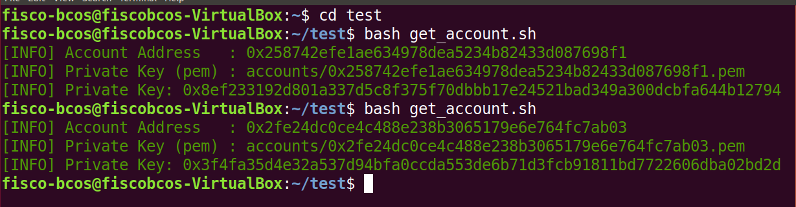

### 3. 分别用两个账户的密钥启动控制台
+ 系统账户：
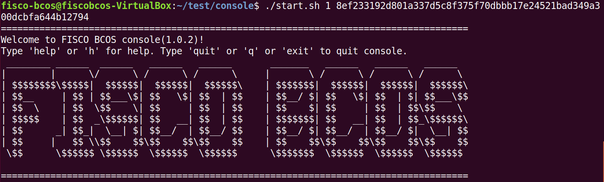
+ 用户账户：
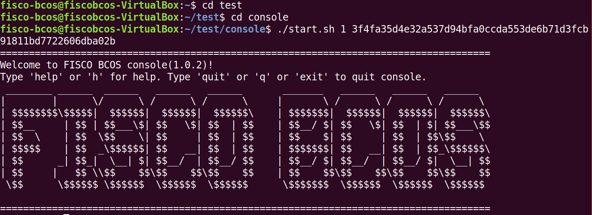

### 4. 部署智能合约，并输入初始系统总积分
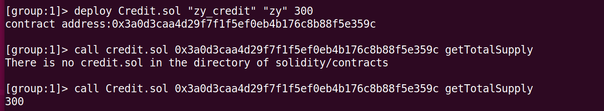

### 5. 分别用两个函数查看总额和此系统账户余额
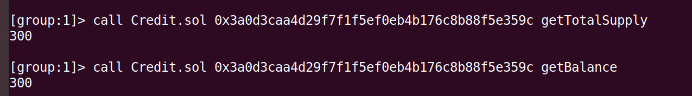

### 6. 查看用户账户余额
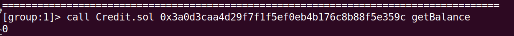

### 7. 使用函数向用户转200积分
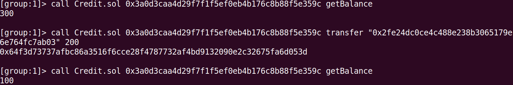

### 8. 分别查看系统账户和用户账户余额
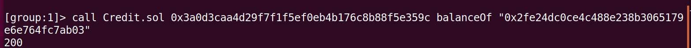
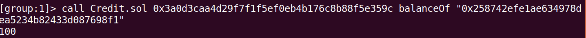

## Spring Boot Starter

### 1. 获取源码
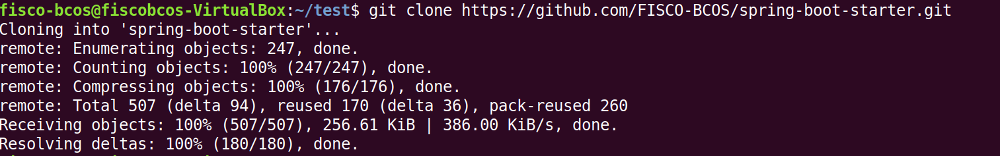

### 2. 运行
好像既有error也有warning，但好像也成功了？
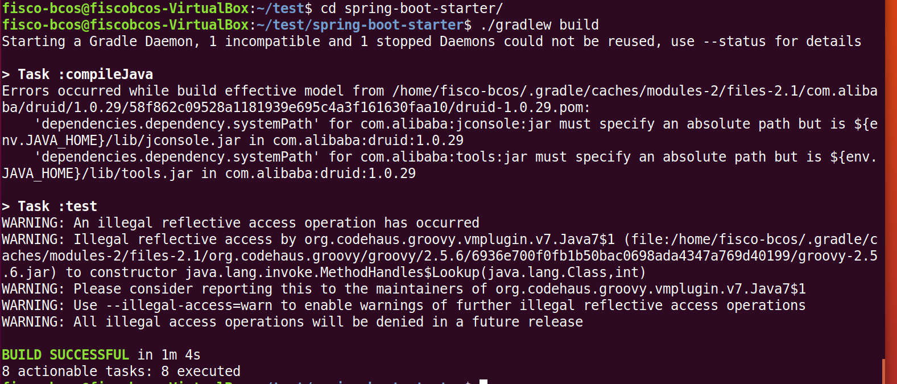
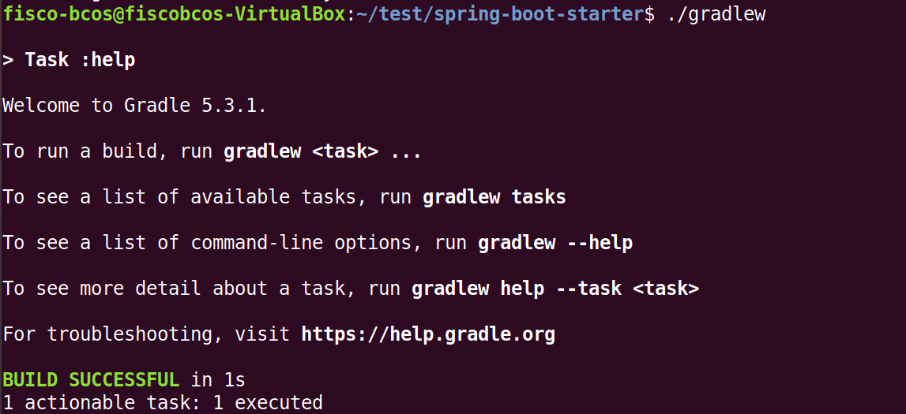
