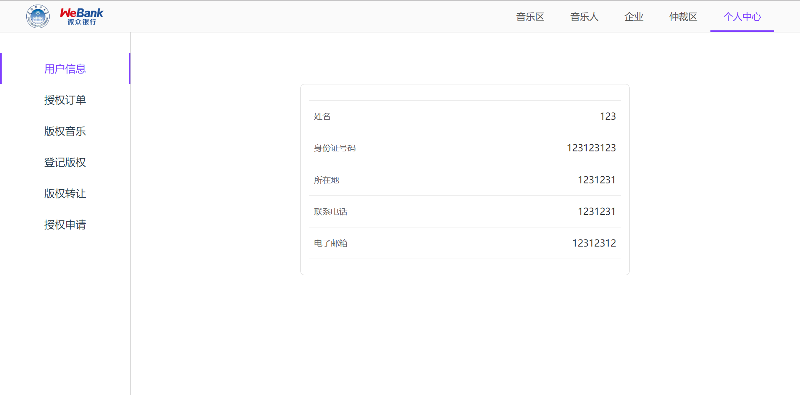

# 音链项目 前端实现

## 说明

前端项目使用 Vue 框架、搭配 Element 实现

实现参考原型：https://org.modao.cc/app/90e8640e1a31563900cfed27bdc1bb13#screen=s229711DEE91561967147540

项目地址为：https://github.com/fisco-bcos-group1/front-end

## 部分界面展示

