## 构建区块链群组及机构

### 下载和安装

> ```
> cd ~/ && git clone https://github.com/FISCO-BCOS/generator.git
> ```

> ```
> cd generator && bash ./scripts/install.sh
> ```

### 拉取节点二进制并检查版本

拉取最新 fisco-bcos 二进制文件到 meta 中，并检查前面的安装是否成功

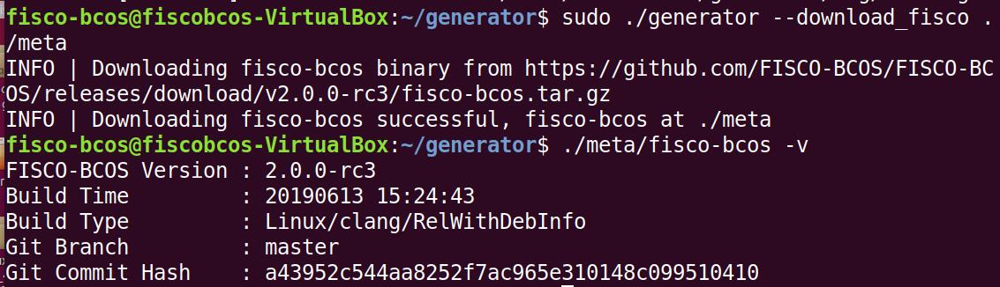

### 机构初始化

#### 初始化机构 A

> ```
> cp -r ~/generator ~/generator-A
> ```

#### 初始化机构 B

> ```
> cp -r ~/generator ~/generator-B
> ```

#### 初始化链证书

需要注意，一条联盟链拥有唯一的链证书 ca.crt。

切换到 generator 目录

> ```
> cd ~/generator
> ```

生成链证书

> ```
> ./generator --generate_chain_certificate ./dir_chain_ca
> ```

查看链证书和私钥

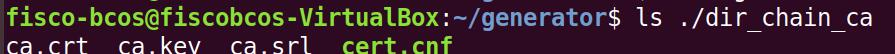

### 由机构 A、B 构建群组

#### 初始化机构 A

生成机构 A 的证书（在证书生成机构目录下，即 generator 目录下操作）

> ```
> ./generator --generate_agency_certificate ./dir_agency_ca ./dir_chain_ca agencyA
> ```

随后查看机构证书及私钥


随后，通过文件拷贝的方式，从证书授权机构将机构证书发送给对应的机构，放到机构的工作目录的 meta 子目录下

> ```
> cp ./dir_chain_ca/ca.crt ./dir_agency_ca/agencyA/agency.crt ./dir_agency_ca/agencyA/agency.key ~/generator-A/meta/
> ```

#### 以相同方式初始化机构 B

### 机构 A 修改配置文件

由于 node_deployment.ini 为节点配置文件，因此会根据该文件下的配置生成相关节点证书等。

切换到 generator-A 目录

> ```
> cd ~/generator-A
> ```

进行配置文件编写

> ```
> cat > ./conf/node_deployment.ini << EOF
> [group]
> group_id=1
>
> [node0]
> ; host ip for the communication among peers.
> ; Please use your ssh login ip.
> p2p_ip=127.0.0.1
> ; listen ip for the communication between sdk clients.
> ; This ip is the same as p2p_ip for physical host.
> ; But for virtual host e.g. vps servers, it is usually different from p2p_ip.
> ; You can check accessible addresses of your network card.
> ; Please see https://tecadmin.net/check-ip-address-ubuntu-18-04-desktop/
> ; for more instructions.
> rpc_ip=127.0.0.1
> p2p_listen_port=30300
> channel_listen_port=20200
> jsonrpc_listen_port=8545
>
> [node1]
> p2p_ip=127.0.0.1
> rpc_ip=127.0.0.1
> p2p_listen_port=30301
> channel_listen_port=20201
> jsonrpc_listen_port=8546
> EOF
> ```

最终该文件修改内容如下：

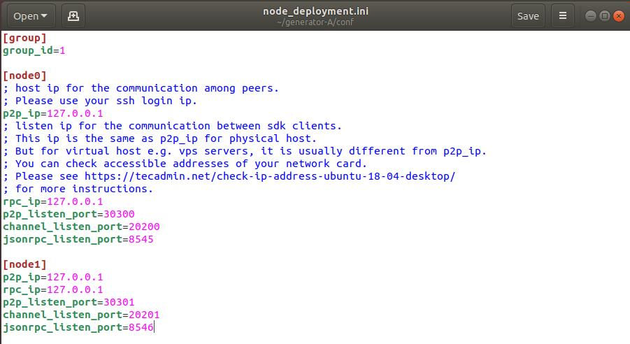

### 机构 B 修改配置文件

同理配置机构 B 的配置文件。

切换到 generator-B 目录

> ```
> cd ~/generator-B
> ```

进行配置文件编写

> ```
> cat > ./conf/node_deployment.ini << EOF
> [group]
> group_id=1
>
> [node0]
> ; host ip for the communication among peers.
> ; Please use your ssh login ip.
> p2p_ip=127.0.0.1
> ; listen ip for the communication between sdk clients.
> ; This ip is the same as p2p_ip for physical host.
> ; But for virtual host e.g. vps servers, it is usually different from p2p_ip.
> ; You can check accessible addresses of your network card.
> ; Please see https://tecadmin.net/check-ip-address-ubuntu-18-04-desktop/
> ; for more instructions.
> rpc_ip=127.0.0.1
> p2p_listen_port=30302
> channel_listen_port=20202
> jsonrpc_listen_port=8547
>
> [node1]
> p2p_ip=127.0.0.1
> rpc_ip=127.0.0.1
> p2p_listen_port=30303
> channel_listen_port=20203
> jsonrpc_listen_port=8548
> EOF
> ```

最终该文件修改内容如下：

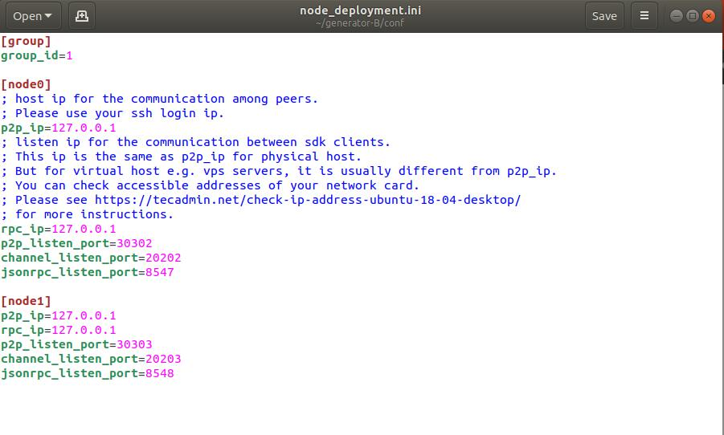

### 机构 A 生成并发送节点信息

切换到 generator-A 目录

> ```
> cd ~/generator-A
> ```

机构 A 生成节点证书及 P2P 连接信息文件，使用了上步配置文件的内容，及机构 meta 文件夹下的机构证书与私钥，最后机构 A 生成节点证书及 P2P 连接信息文件。

> ```
> ./generator --generate_all_certificates ./agencyA_node_info
> ```

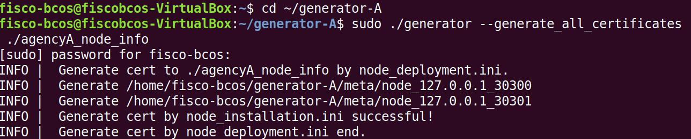

查看生成的文件：


cert_127.0.0.1_30300.crt 和 cert_127.0.0.1_30301.crt 为需要交互给机构 A 的节点证书，peers.txt 为节点 P2P 连接地址文件。

由于机构生成节点时需要指定其他节点的节点 P2P 连接地址，因此，A 机构需将节点 P2P 连接地址文件发送至机构 B。

> ```
> cp ./agencyA_node_info/peers.txt ~/generator-B/meta/peersA.txt
> ```

### 机构 B 生成并发送节点信息

切换到 generator-B 目录

> ```
> cd ~/generator-B
> ```

机构 B 生成节点证书及 P2P 连接信息文件,同上步。

> ```
> ./generator --generate_all_certificates ./agencyB_node_info
> ```

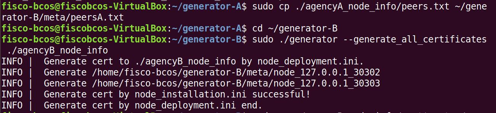

生成创世区块的机构需要节点证书，示例中由 A 机构生成创世区块，因此 B 机构除了发送节点 P2P 连接地址文件外，还需发送节点证书至机构 A。

> ```
> cp ./agencyB_node_info/cert*.crt ~/generator-A/meta/
> ```

由于机构生成节点时需要指定其他节点的节点 P2P 连接地址，因此，B 机构需将节点 P2P 连接地址文件发送至机构 A。

> ```
> cp ./agencyA_node_info/peers.txt ~/generator-A/meta/peersB.txt
> ```

### 机构 A 生成群组创世区块

切换到 generator-A 目录

> ```
> cd ~/generator-A
> ```

机构 A 修改 conf 文件夹下的`group_genesis.ini`

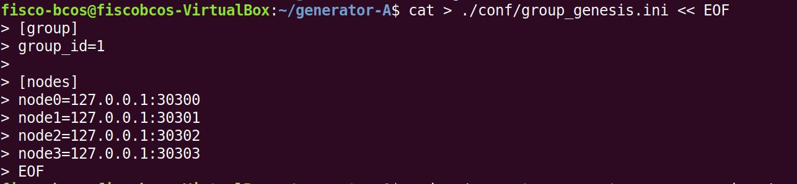

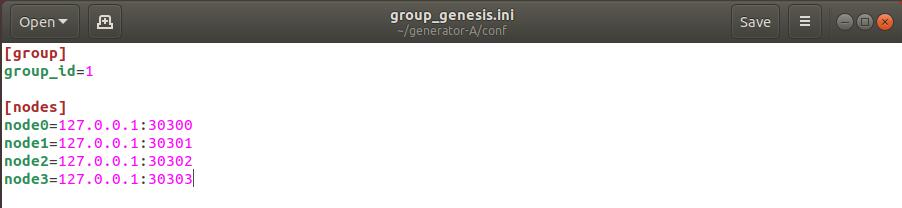

group_id 为群组 id，node0 和 node1 都为机构 A 节点 p2p 地址，node2 和 node3 均为机构 B 的节点 p2p 地址。

根据机构 A 的 meta 文件夹下配置的节点证书，生成 group_genesis.ini 配置的群组创世区块。

> ```
> ./generator --create_group_genesis ./group
> ```

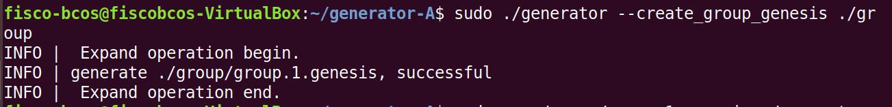

分发群组的创世区块至机构 B：

> cp ./group/group.1.genesis ~/generator-B/meta

### 机构 A 生成所属节点

切换到 generator-A 目录

> ```
> cd ~/generator-A
> ```

生成机构 A 所属节点，此命令会根据用户配置的`node_deployment.ini`文件生成相应的节点配置文件夹:

> ```
> ./generator --build_install_package ./meta/peersB.txt ./nodeA
> ```

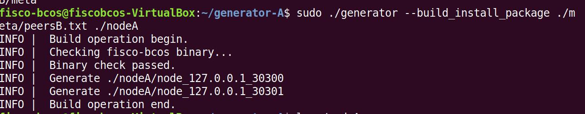

生成后，查看生成节点配置文件夹：

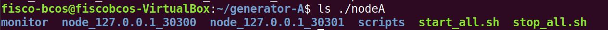

其中，monitor 为脚本，node\_...为对应地址服务器端口号的节点配置文件夹，scripts 为节点的相关工具脚本，start_all.sh 和 stop_all.sh 分别为批量节点启动和停止的脚本。

机构 A 启动节点

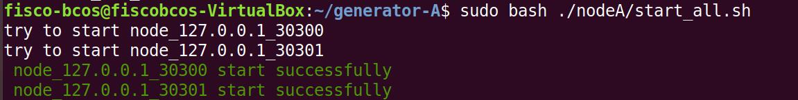

使用如下命令查看节点进程：

> ```
> ps -ef | grep fisco
> ```

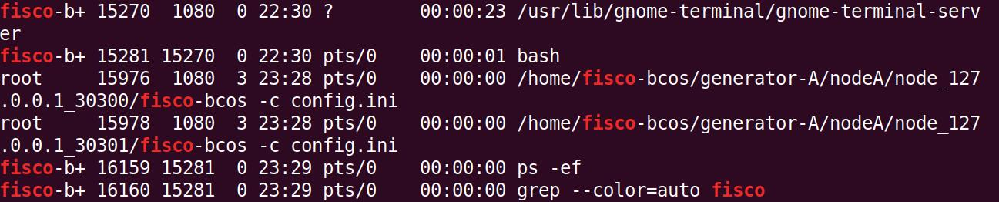

### 机构 B 生成所属节点

切换到 generator-B 目录

> ```
> cd ~/generator-B
> ```

生成机构 B 所属节点，此命令会根据用户配置的`node_deployment.ini`文件生成相应的节点配置文件夹:

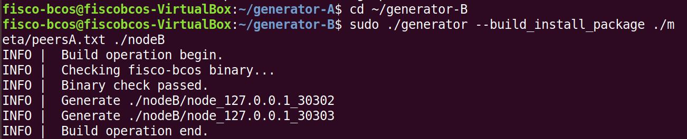

机构 B 启动节点：

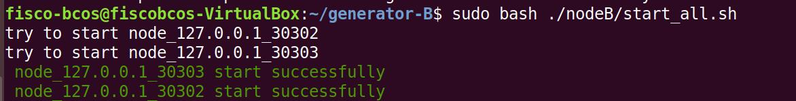

### 查看群组节点运行状态，完成搭建群组的工作

查看进程：

```
ps -ef | grep fisco
```

可以看到如下进程：

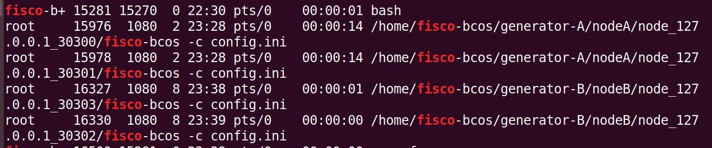

查看节点 log：

```
tail -f ./node*/node*/log/log*  | grep +++
```

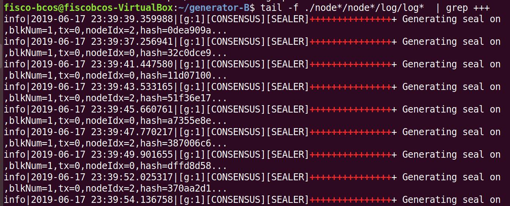

搭建完成，此时机构 A、B 群组情况如下图：


