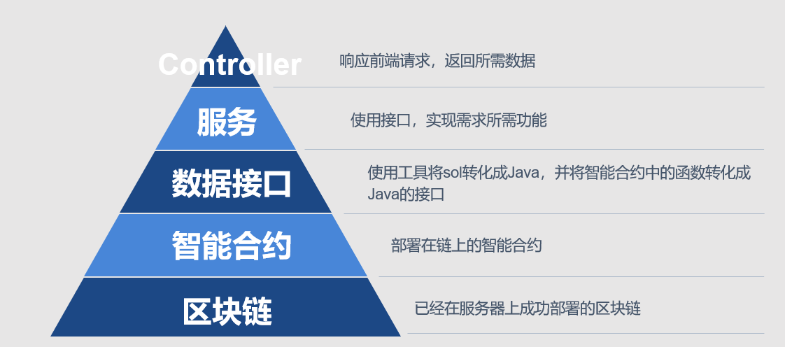

# 第四周周报
## 项目环境配置
+ IDE：IntelliJ IDEA 
+ jdk ：1.8.0_211
+ Gredle：5.3.1

## 后端架构


后端的整体架构大约分为3层：数据接口、服务层和Controller层，结构如上图所示。

+ **数据接口**：在智能合约转化成java文件以后，对其暴露的函数接口进行封装，使接口更加美观，方便服务层进行调用
+ **服务层**：利用数据接口实现需求，使其可以被Controller层所调用
+ **Controller**：响应前端的请求，并返回所需的数据

## 具体实现
下面陈述具体的项目结构设计，列出具体的包以及类。
### 1. Package：autoconfigure
存放系统所需的配置。

### 2. Package：constants
存放系统常量，具有下列class：
+ ConnectConstants：
CONNECT_SECONDS = 30;
CONNECT_SLEEP_PER_MILLIS = 1;
TIME_OUT = 30000;

+ GasConstants：
BigInteger GAS_PRICE = new BigInteger("300000000");
BigInteger GAS_LIMIT = new BigInteger("300000000");

### 3. Package: contracts
用于存放已经转化好的智能合约。

### 4. Package: controller
用于存放相关控制器，用于响应前台的响应。将在后文详细阐述。

### 5. Package: entity
用于存放相关实体类。将在后文详细阐述。

### 6. Package: function
用于包装智能合约的接口

### 7. Package: service
使用function中提供的接口，提供服务。并存放其他所需函数。
+ ContractService: 提供public static Transfer getTransfer(String privateKey)，即用户使用私钥加载合约。
+ CreateUser：提供public static List<String> createRomdonUser()，即生成一个新用户，并返回该用户的私钥和地址。

## 具体实例
下面是具体实例的详细内容，每个类中都要生成两个构造函数，一个接受所有参数值，一个不接受值（出Result类以外）。每个类中的每个参数都生成get和set方法。

### 1. Music:  歌曲
```
    private String mName;    //歌曲名称
    private String singer;       // 歌手
    private String owner;        // 版权所有者
    private String bin;          // 音乐二进制文件哈希
    private boolean isValid;     // 版权是否有效
    private String alltime;     //所有时间，beg_time # end_time # modified
```

### 2. Notice:   由用户发起的交易
```
    private String start;  // 通知发起方
    private String to;    // 接收方
    private String music;  // mname # singer # recordTime # applyTime
    private String info;  // applicantName # phone # use # location # length # text # price
    private boolean valid;     // 是否授权
```

### 3. Record:   交易成功记录
```
    private String user;   // 被授权人地址
    private String author;   // 授权人/版权拥有人地址
    private String alltime;  // 所有时间，beg_time # end_time # modified
    private String music;   // bin # mname # singer # owner
    private String info;      // applicantName # phone # use # location # length # text # price
```


### 4. User: 用户信息
```
    private String name;   //姓名或企业名称
    private String id;     //身份证号码或者企业编码
    private String location;    //所在地
    private String phone;      //联系电话
    private String email;      //电子邮箱
    private String type;       // 用于判断是那种类型的用户
```

### 5. RecordInformation: 信息综合
```
    private Music music;
    private User user;
```

### 6. Result: 返回给前端的特殊数据类型
```
    private int success;   //判断结果
    private String message;  //返回信息
    private Object data;    //可以存放不同类型的数据进行返回
```
## 具体接口
该部分具体阐述在Controller层于前端的接口。

所有接口均返回Result类型的数据，其中包括结果信息代号、结果信息和前端需要的具体数据，若无需具体数据返回，则参数data为空。下文所指返回数据为Result类中的data参数，若没有写出则说明data为空。

### 1. CompanyController：用于企业认证
+ RegisterCompany
作用：完成企业认证；
输入：name,id,location,phone,email；

### 2. JudgeController：用于仲裁页面
+ Register
作用：用于完成仲裁认证；
输入：name,id,location,phone,email
+ SearchingRecord
作用：版权查询，响应点击搜索按钮；
输入：musicName,singer；
返回：recordInformation
+ JudgeInformation
作用：返回仲裁机构信息；
输入：无；
返回：User

### 3. LoginController：用于登陆注册页面
+ Register
作用：用于响应点击注册按钮；
输入：name,phone；
返回：List<String> 用户的私钥和地址
+ Login
作用：响应点击登陆；
输入：用户私钥

### 4. MainController: 用于音乐区
+ Search
作用：搜索音乐；
输入：musicName,singer；
返回：Music
+ ConfirmAuthorize
作用：响应确定申请授权；
输入：music,to,info

### 5. MusicianController：用于响应音乐人界面
+ RegisterMusician
作用：响应音乐人注册；
输入：name,id,location,phone,email

### 6. UserController：用于相应个人中心
+ enterpriseInformation
作用：显示用户信息，可用于企业、音乐人、普通用户；
输入：无；
返回：User
+ ShowNoticeStartByMe
作用：显示由我发出的所有Notice；
输入：无；
返回：List<Notice> Notice的列表
+ ShowMuiscOwnedByMe
作用：显示所有拥有者为我的音乐；
输入：无；
返回：List<Music> 音乐列表
+ RecordTransfer
作用：应用于版权转让；
输入：to,bin,alltime
+ CancelMusic
作用：用于注销音乐版权；
输入：bin,alltime
+ MusicRegister
作用：用于响应登记版权；
输入：bin，musicName,alltime
+ ShowNotice
作用：显示所有发给我的Notice，即我是接收者；
输入：无；
输出：List<Notice> Notice列表
+ AuthorizeMusic
作用：用于点击确定授权；
输入：bin,alltime,to,music,info,NoticeNumber


