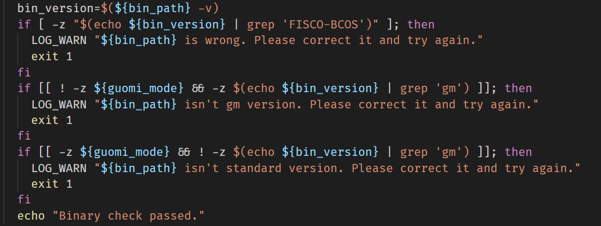
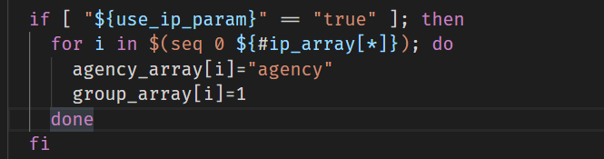
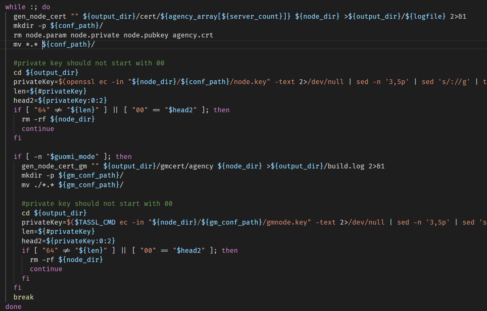
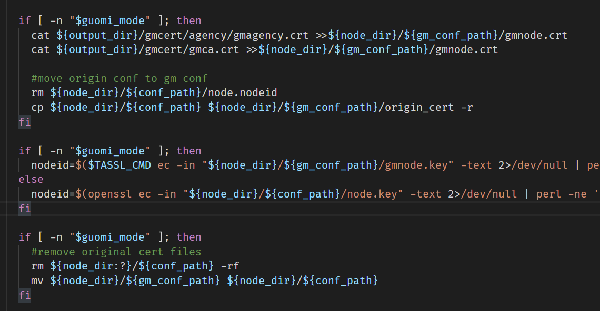

# main 函数阅读

- 判断参数`use_ip_param`的值
  - 为空，说明没用-l 或-f
  - 为真，说明用了-f，从 args 获取配置路径的值
  - 为假，说明用了-l
- `dir_must_not_exists ${output_dir}`断言目标文件夹一定不存在，如果存在，则说明建链脚本已经运行过了
- 判断是否自定义 fisco_version，一般自动去获取版本，然后用 sed 获取版本号

```shell
$(curl -s https://raw.githubusercontent.com/FISCO-BCOS/FISCO-BCOS/master/release_note.txt | sed "s/^[vV]//")
```

- 在非 docker 模式下，判断是否自定义 fisco-bcos 二进制文件的路径以及 OS 的类型是否已知？

  - 没有自定义或不知道 OS 类型：判断是不是国密模式，然后到 github 中下载相应版本的压缩包；然后下载，解压，授权；
  - 没有自定义但是 OS 不为空：说明是 MacOS 　// 这里有点没懂
  - 自定义路径：1. 检查该路径下的二进制文件是否正确；2. 检查是不是国密版本；3. 检查输入模式和文件模式是否匹配

  

- 如果没有用-t 指定证书，那就在当前目录下新建一个 cert.cnf 证书；如果有指定，就拷贝过来

- 如果是通过配置文件配置参数的，执行这个——我没看懂



- 生成 CA 证书

  - 断言 /nodes/chain 不存在
  - 生成 chain 证书在 /nodes/chain 下，再拷贝至 /nodes/cert 中
  - 又根据配置，生成 agency 证书

- 生成国密证书
  - 检查安装 tassl ？
  - 生成 cnf，cert，key 等。。。
- 给所有 ip 生成证书私钥之类的
  - 对每个 ip，格式`127.0.0.1:4`，获取 ip 和节点数 num
  - 迭代节点数 num，生成节点目录 node0， node1...
  - 然后对每个节点生成自己的节点证书等。。下图一
  - 如果是国密模式，进行一通操作。。如下图二
  - 然后对每个 ip 生成 sdk，似乎也是一堆证书





- 给所有 ip 生成对应的节点配置和启动停止脚本
- 最后删掉 log 信息，打印建链结果

## Linux 命令学习笔记

- `set -e` 若命令执行结果值不等于 0，立刻退出 shell
- 函数 `check_env` 主要是 判断有没有装 openssl 还有判断 OS 是哪个
- `-z` 判断值为不为 0

- `uname -s` 显示操作系统名称
- shell getopts 的用法

```shell
  while getopts "f:l:o:p:e:t:v:icszhgTFdC:S" option; do echo "."; done
  # 这里的f，l，o等参数需要附加值
  # 而icszhgTFdS可以不附加值
```

- local 定义变量，作用域仅限在函数体内

- `pwd` 显示当前工作目录
