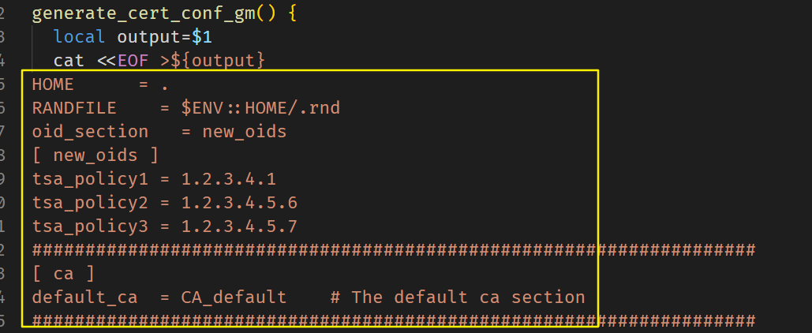
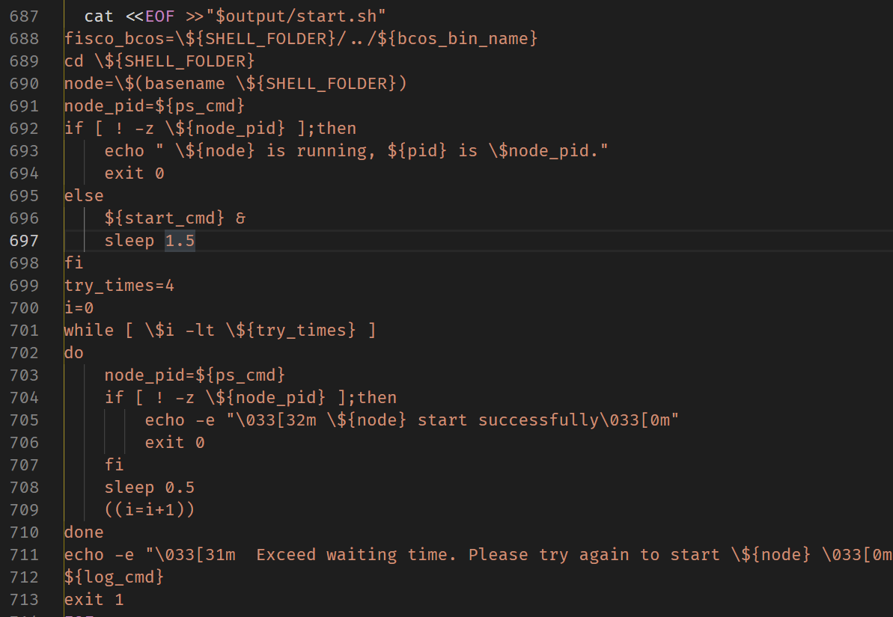
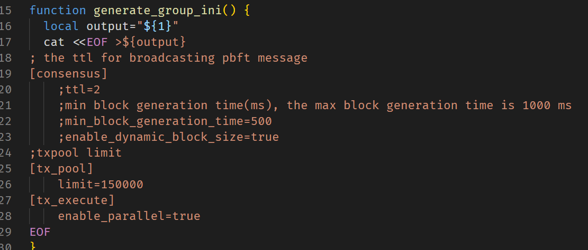

# 周报 —— 第一周

## 任务

1. 读懂 build_chain.sh 脚本执行的工作，并写个简单报告。推荐使用 Markdown 写报告。可放在 Github 项目里算作工作量；
2. 制作 PPT 讲解脚本；
3. 尝试使用控制台的更多命令；
4. （可选）尝试阅读[FISCO BCOS 的技术文档](https://fisco-bcos-documentation.readthedocs.io/zh_CN/latest/index.html)，并加深认识。

> 相关链接：
> bulid_chain.sh 的[github 链接](https://github.com/FISCO-BCOS/FISCO-BCOS/blob/master/tools/build_chain.sh)
> build_chain.sh 的[官方说明资料](https://fisco-bcos-documentation.readthedocs.io/zh_CN/latest/docs/manual/build_chain.html)

## 分工

1. 辅助函数：除 main 函数、有 gen 和 generate 字段的函数之外的函数
2. 生成证书的函数：有 cert 字样的函数
3. 生成脚本的函数：有 script 字样的函数、genTransTest()
4. 生成配置文件的函数：有 genesis、ini 字样的函数
5. 主函数：main 函数

## 说明

- 此次任务的 md 文件里所涉及的所有图片，存放在`./assets/`文件夹（也就是 `~/WeBank/周报/Week1/assets/`）下，图片路径不能是本机的绝对路径
- `Temp/build_chain.sh`是使用格式化程序格式化后的程序，比原文件稍微好看一点点`
- `Note/`文件夹存放每个人的阅读笔记，文件命名随意吧。最后形成一个`Week1.md`周报
- 笔记的格式暂时不定
- 为了让大家看的方便，我把`build_chain.sh`生成的所有文件拷贝至`Temp/fisco`文件夹下。

## 要求

### 所有

- 对于代码中出现的 Linux 的命令，建议查阅资料，并简要记录命令的作用是什么，一般命令有很多参数，将代码里用到的参数做个简要的描述就好，如：
  - `set -e` 若命令执行结果值不等于 0，立刻退出 shell
  - `uname -s` 显示操作系统名称

### 阅读生成证书的函数

- 除了大概记录每个函数的功能外
- 参考文档，把如下图中涉及到的配置项功能简要记录

### 阅读生成脚本的函数

- 源码中有几个函数会有如下图的内容，是用于生成脚本的
- 可以对比已经生成了的脚本理解

### 阅读生成配置的函数

- 对于涉及的配置项，需要知晓每个配置项的功能作用

